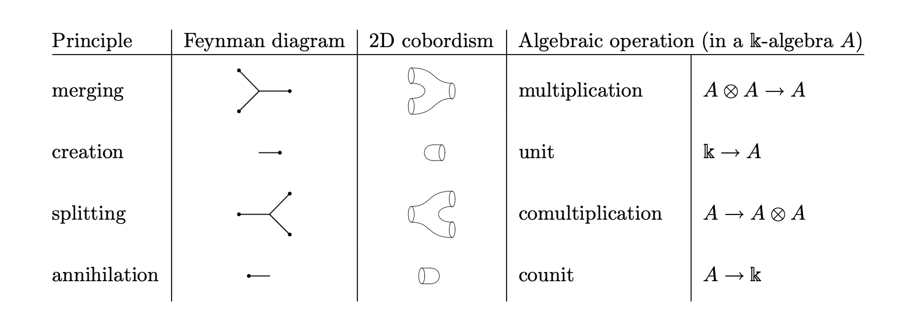
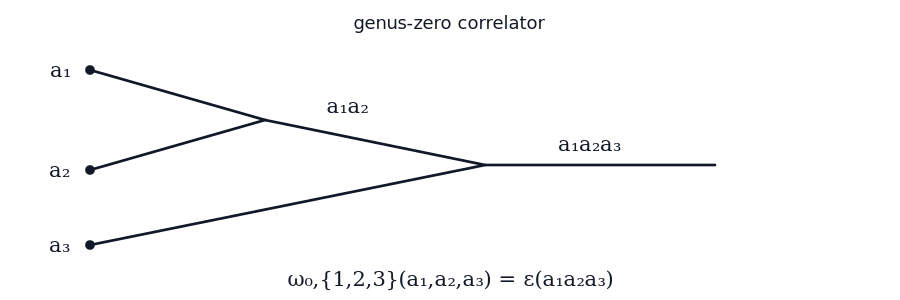
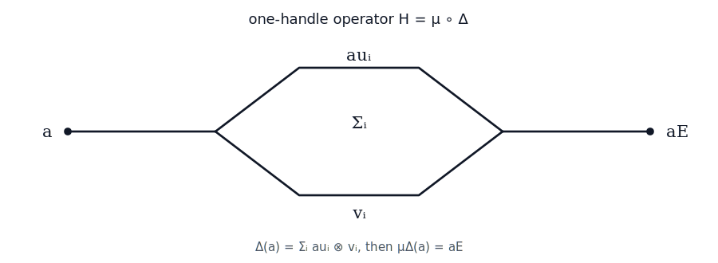
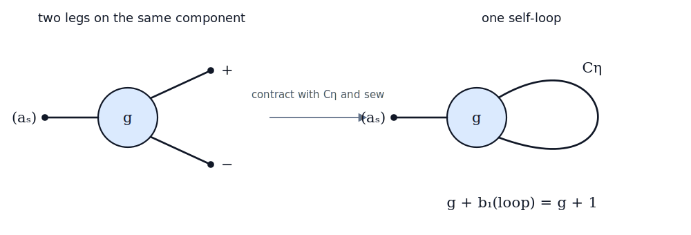
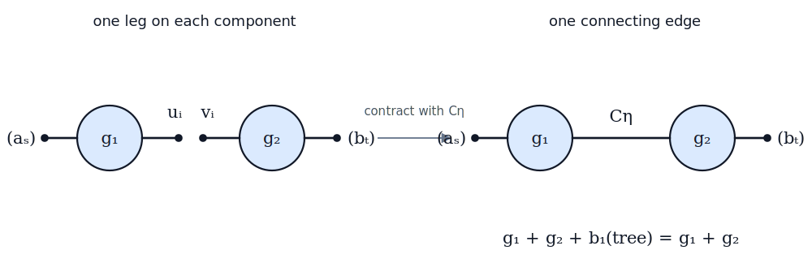

# M2. Two-dimensional topological field theory

This note explains how a commutative Frobenius algebra determines all correlators of a closed oriented two-dimensional topological field theory.

## 1. Bordisms and field theories

An **oriented 2D TFT** is a symmetric monoidal functor

$$
Z:\operatorname{Bord}^{\mathrm{or}}_2\longrightarrow R\text{-}\operatorname{Mod}.
$$

Objects of the bordism category are closed oriented one-manifolds, and morphisms are compact oriented surfaces with incoming and outgoing boundary. The monoidal operation is disjoint union.

The **state space** is the value on a positively oriented circle:

$$
A=Z(S^1).
$$

The pair of pants gives multiplication or comultiplication according to its orientation. The two disks give the unit and counit, and the cylinder gives the identity. Relations between different decompositions of a surface give the Frobenius algebra axioms.

Conversely, a commutative Frobenius algebra assigns maps to pair-of-pants decompositions. The Frobenius identities prove that the result is independent of the chosen decomposition. This gives the classification

$$
\text{oriented 2D TFTs over }R
\simeq
\text{commutative Frobenius }R\text{-algebras}.
$$

### Feynman-diagram dictionary

We read the diagrams from left to right. A **black dot** marks an external circle carrying a state. A **trivalent junction** is a pair-of-pants bordism: two legs merging into one denote multiplication, while one leg splitting into two denotes comultiplication. A leg created from no input denotes the unit, and a leg ending with no output denotes the counit.

The base field denoted by $\mathbb{k}$ in the dictionary plays the role of the base ring $R$ used in these notes.

## 2. Finite-labelled correlators

Let $S$ be a finite type. The TFT assigns to a connected genus-$g$ surface with incoming boundary circles labelled by $S$ and no outgoing boundary an $R$-linear functional

$$
\omega_{g,S}:\bigotimes_{s\in S}A\longrightarrow R.
$$

This functional is the **connected genus-$g$, $S$-labelled correlator**. Equivalently, $\omega_{g,S}$ is multilinear in a family of states $(a_s)_{s\in S}$, where the circle labelled by $s$ carries $a_s\in A$. Using a label type rather than only the number $|S|$ makes relabelling and gluing canonical: a bijection $S\simeq T$ reindexes the inputs, while disjoint collections of inputs are indexed by $S\sqcup T$.

Suppose first that $S$ is nonempty. Choose a pair-of-pants decomposition that merges the incoming circles until only one intermediate circle remains. Multiplication at the merging vertices places the state

$$
x=\prod_{s\in S}a_s.
$$

on that circle. The product is independent of the order of the labels because $A$ is commutative.

At genus zero, the intermediate circle is capped by a disk, which applies the counit:

$$
\omega_{0,S}((a_s)_{s\in S})
=
\epsilon(x)
=
\epsilon\left(\prod_{s\in S}a_s\right).
$$

The intermediate circle belongs only to the chosen decomposition; it is not an additional boundary circle of the original surface. Different decompositions may parenthesize the product differently, but associativity gives the same result.

When the genus is greater than zero, handles are inserted before the intermediate circle is capped. A one-handle cobordism is the composite of a splitting pair of pants and a merging pair of pants, so its **handle operator** is

$$
H=\mu\circ\Delta:A\longrightarrow A.
$$

Using $\Delta(a)=(a\otimes1)C_\eta$ and $E=\mu(C_\eta)$, we obtain

$$
H(a)
=\mu\bigl((a\otimes1)C_\eta\bigr)
=a\,\mu(C_\eta)
=aE.
$$

Thus one handle acts by multiplication by $E$, and $g$ handles act by

$$
H^g(x)=xE^g.
$$

Capping the final circle gives, for nonempty $S$,

$$
\boxed{\displaystyle
\omega_{g,S}((a_s)_{s\in S})
=
\epsilon\left(\prod_{s\in S}a_s\,E^g\right).}
$$

Equivalently, cutting a handle open produces two boundary circles. Sewing them together inserts the copairing $C_\eta=\sum_i u_i\otimes v_i$, and merging its two legs contributes $\sum_i u_iv_i=\mu(C_\eta)=E$. The Frobenius identities ensure that this value is independent of the chosen pair-of-pants decomposition.

As a genus-one example, take two incoming circles carrying $a,b\in A$. Merging them gives the state $ab$. Writing $C_\eta=\sum_i u_i\otimes v_i$, the handle acts by

$$
ab
\xmapsto{\ \Delta\ }
\Delta(ab)
=
\sum_i abu_i\otimes v_i
\xmapsto{\ \mu\ }
\sum_i abu_iv_i
=abE.
$$

The final cap applies the counit, hence

$$
\omega_{1,\{1,2\}}(a,b)
=\epsilon(abE).
$$

When $S$ is empty, a unit disk creates an intermediate circle carrying $1_A$. Applying the $g$ handle operators and then the counit gives the **partition function**

$$
Z(\Sigma_g)=\epsilon(E^g).
$$

This is the same correlator formula with the convention that the empty product is $1_A$. In particular, the genus-one closed surface is the torus, and

$$
Z(T^2)=\epsilon(E).
$$

Finally, the genus-zero one-, two-, and three-point correlators recover the basic Frobenius data:

$$
\omega_{0,1}(a)=\epsilon(a),
\qquad
\omega_{0,2}(a,b)=\eta(a,b),
\qquad
\omega_{0,3}(a,b,c)=\epsilon(abc)=\eta(ab,c).
$$

The one-point correlator is the counit, the two-point correlator is the Frobenius pairing, and the perfectness of that pairing means that the three-point correlator determines the multiplication.

## 3. Sewing identities

Write the copairing as $C_\eta=\sum_i u_i\otimes v_i$. Its contraction identity implies the basic sewing formula

$$
\sum_i\epsilon(xu_i)\epsilon(v_i y)=\epsilon(xy).
$$

The left-hand side inserts the two legs of the copairing at the boundaries being sewn. The defining identity of $C_\eta$ contracts those two insertions, leaving the product $xy$ on the sewn surface.

**Nonseparating sewing** identifies two distinguished boundary circles on the same connected surface and creates a handle:

$$
\sum_i
\omega_{g,S\sqcup\{+,-\}}
((a_s),u_i,v_i)
=
\omega_{g+1,S}((a_s)).
$$

In the Feynman graph, this contraction creates a self-loop. The loop has first Betti number one, so it raises the total genus from $g$ to $g+1$.

**Separating sewing** identifies one distinguished boundary circle on each of two connected surfaces and joins the components:

$$
\sum_i
\omega_{g_1,S\sqcup\{*\}}((a_s),u_i)
\omega_{g_2,T\sqcup\{*\}}((b_t),v_i)
=
\omega_{g_1+g_2,S\sqcup T}((a_s),(b_t)).
$$

Here the new edge joins two previously distinct vertices and creates no graph cycle. Its first Betti number is zero, so the genus of the connected surface is $g_1+g_2$.

Symmetry of $C_\eta$ shows that neither sewing operation depends on the ordering of the two half-edges.

## 4. Topological CohFT viewpoint

Restricting to stable pairs $2g-2+|S|>0$ and multiplying each scalar correlator by the unit class in $H^0(\overline{\mathcal M}_{g,S})$ gives a topological, degree-zero CohFT. A general CohFT has higher-degree cohomology classes and therefore contains more information than its Frobenius algebra or associated TFT.

The next phase replaces scalar targets by an abstract system of cohomology groups for stable-curve moduli spaces. See [M3: stable curves and gluing](M03StableCurvesAndGluing.md).
